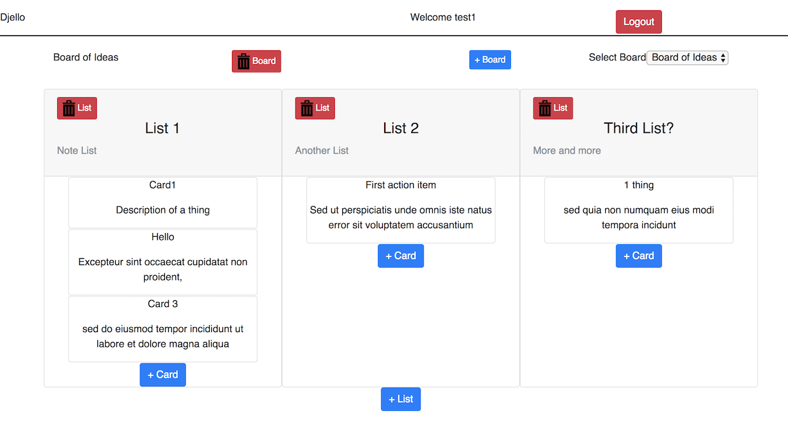

# Djello

A reproduction of Trello using a fullstack JavaScript stack.



Live Demo: https://chuckstaskboards.herokuapp.com/

## Getting Started

### Prerequisites

```
 + npm
 + PostgreSQL
```

### Installing - server

Install modules

```
npm install
```

Edit `config/config.json` file for your Postgres database details, then run the server

```
npm run server
```

### Installing - server - optional

For unique signed cookies, create a `.env` in the root directory

```
touch .env
```

In the .env file add

```
SECRET=123123
```

### Installing - client

Change to client directory

```
cd client/
```

Install modules

```
npm install
```

Next is to edit the fetch url in `src/actions/constents/database` to your server's address (or `ip address` and `port`) eg.

```javascript
export const database = "http://127.0.0.1:3001";
```

Then run the react development server

```
npm start
```

## Built With

* [React](https://reactjs.org/docs) - The front facing web framework used
* [Express](https://expressjs.com/) - The server side framework used
* [PostgreSQL](https://www.postgresql.org/docs/) - The SQL database used

## Author

* **Chuck Michael** - _Initial work_ - [chuckinabox](https://github.com/chuckinabox)

## License

This project is licensed under the MIT License - see the [LICENSE](LICENSE) file for details
